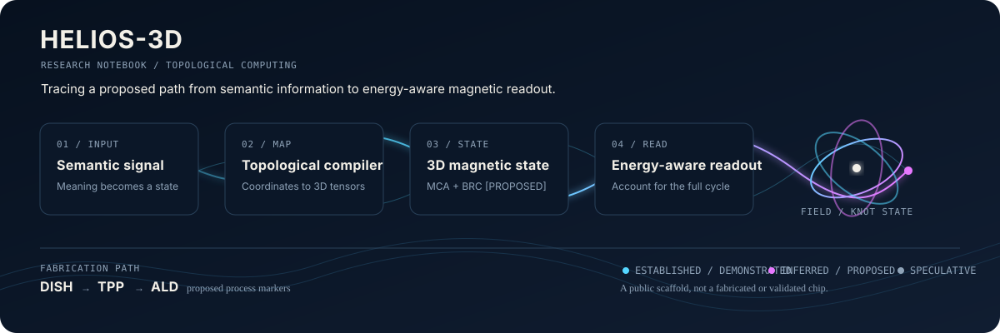

<div align="center">



# Hybrid-manufactured Energy-Landscape Inference and Operation System

**Speculative spintronic research exploring topological magnetism for ultra-low energy computation**

[](https://helios-3d.vercel.app/)
[](https://myrqyry.github.io/HELIOS-3D/)
[](https://www.python.org/)
[](https://astro.build/)
[](./LICENSE)

</div>

HELIOS-3D is a public research notebook for investigating whether spintronic,
topological, and thermodynamic-computing mechanisms could support future
low-energy inference architectures near fundamental efficiency limits.

The repository connects literature, claim tracking, compiler scaffolding,
simulation templates, and proposed fabrication paths so that a difficult
hypothesis remains inspectable.

> [!WARNING]
> HELIOS-3D is not a fabricated chip, validated hardware design, or claim of
> demonstrated sub-Landauer computation. Physical validation remains an open
> research requirement.

## Start with the reproducible checks

The fastest useful first action is to run the validation paths that cover the
active app, research checks, and Python test suite. These commands verify
software and documentation scaffolding, not a physical device.

```bash
# Active Vite app
pnpm --dir app test --run
pnpm --dir app build

# Research and claims validation
make check-claims
make test
```

These checks cover compiler logic, claims taxonomy, simulations, and the
documentation pipeline. They do not validate micromagnetic dynamics on actual
hardware, execute a physical MuMax3/OOMMF device, or establish sub-Landauer
operation.

## Research map

HELIOS-3D separates the research question into an inspectable path from
information to physical state and back to measurement.

| Stage | What it investigates | Current status |
|---|---|---|
| Semantic signal | How an input representation becomes a physical state | Compiler scaffold |
| Topological compiler | Mapping semantic embeddings to 3D magnetization tensors | Coordinate and mock-IFE tests |
| Magnetic state | MCA and BRC architectures using spin textures and thermal dynamics | `[PROPOSED]` |
| Energy-aware readout | Accounting for preparation, update, readout, reset, and error correction | Validation guardrail |

### Dual-core architecture

The proposed architecture explores two complementary roles. The Magnetic
Convolutional Accelerator (MCA) is a deterministic sensory preprocessor using
compute-in-memory spintronics. The Brownian Reservoir Computing (BRC) core is a
probabilistic decision-maker using noise-driven thermodynamic processing.

| Core | Role | Status |
|---|---|---|
| **Magnetic Convolutional Accelerator (MCA)** | Deterministic sensory preprocessor via compute-in-memory spintronics | `[PROPOSED]` |
| **Brownian Reservoir Computing (BRC) Core** | Probabilistic decision-maker using noise-driven thermodynamic processing | `[PROPOSED]` |

Modern silicon scaling faces constraints from inelastic scattering and
energy-intensive data movement. HELIOS-3D investigates whether information
carriers can move away from electrical charge toward topologically structured
spin states. The advantage of a Hopfion-like state over a skyrmion is treated
as an inference from theory, not a demonstrated device property.

### Proposed fabrication path

The current fabrication vocabulary is a research path, not a manufacturing
recipe:

```text
DISH -> TPP -> ALD
```

- **DISH:** Digital Incoherent Synthesis of Holographic light fields
- **TPP:** Two-Photon Polymerization
- **ALD:** Atomic Layer Deposition

## Current status

**Phase 0.5: Documentation + Validation Scaffolding**

The repository currently contains concrete software and documentation
artifacts around a longer-range physical hypothesis.

| Component | Description | Status |
|---|---|---|
| **Topological Compiler** | Python mapping layer translating semantic embeddings to 3D magnetization tensors | Scaffold |
| **Compiler Tests** | Coordinate mapping fidelity and Hopf Index synthesis (`Q_H = 1`) via a mock IFE transfer function | Passing |
| **PINN Environment** | Physics-Informed Neural Network training infrastructure | Configured |
| **Micromagnetic Simulation** | MuMax3/OOMMF configuration files | Templates |

## Thermodynamic guardrails

HELIOS-3D treats energy claims as operation-accounting questions rather than
single-reset calculations.

1. **CRUD accounting:** Information-thermodynamics work frames Landauer's
   erasure bound as the delete-specific limit of a broader
   Create/Read/Update/Delete lifecycle. Any proposed advantage must account for
   preparation, update, measurement, overwrite, reset, and protocol-dependent
   dissipation. `[ESTABLISHED]`
2. **Reversible operation accounting:** Work on quantum-coherent spin dynamics
   provides adjacent evidence for post-Landauer physical-computing approaches
   where storage, transport, and computation may share a state variable. It
   motivates explicit accounting for readout, reset, transport, and error
   correction. `[INFERRED]`
3. **Reservoir thermodynamics:** Theory on quantum reservoir computing links
   predictive performance to microscopic energetic cost. HELIOS-3D uses this as
   a framework for comparing useful retained information with the irreversible
   work of continuous processing. `[INFERRED]`

Sub-Landauer behavior remains a long-range research question, not a current
capability claim.

## Claims protocol

Every claim is tagged so readers can distinguish sourced physics from
architectural integration and unverified targets.

| Tag | Meaning |
|---|---|
| `[ESTABLISHED]` | Supported by established physics or directly sourced background |
| `[DEMONSTRATED]` | Verifiable in peer-reviewed literature or an explicit repository check |
| `[INFERRED]` | Plausible extrapolation from established physics |
| `[PROPOSED]` | Architectural integration suggested by HELIOS-3D |
| `[SPECULATIVE]` | Theoretical target or unverified projection |

The [Claims Matrix](./src/content/docs/current/claims-matrix.mdx) provides
claim-by-claim traceability, failure notes, and promotion criteria.

## Getting started

Clone the repository and run the focused compiler test after installing the
Python environment.

```bash
cd HELIOS-3D
uv sync
uv run pytest tests/test_topological_compiler.py
```

## Why this research exists

AI systems concentrate energy and material demand in data centers and
semiconductor supply chains. HELIOS-3D investigates whether topological
magnetism could let thermal noise assist useful computation while three-
dimensional scaling reduces physical and embodied footprint.

The motivation is not evidence for the architecture. It is the reason to make
the accounting, assumptions, and failure modes explicit.

## Repository structure

The active application lives under `app/`; the root also retains legacy
research and site paths that are still referenced by existing material.

| Path | Description |
|---|---|
| `app/` | Active Vite/React application |
| [`research_specifications/module_5_topological_compiler_tdd.md`](./research_specifications/module_5_topological_compiler_tdd.md) | Formal physics and architecture modules |
| [`simulations/README.md`](./simulations/README.md) | MuMax3 and OOMMF configuration files |
| `compiler/` | Topological Compiler implementation |
| `analysis/` | Data validation and spintronic analysis scripts |

## Continue reading

- [Documentation](https://helios-3d.vercel.app/)
- [Roadmap](./ROADMAP.md)
- [Contributing](./CONTRIBUTING.md)
- [Claims Matrix](./src/content/docs/current/claims-matrix.mdx)
- [Legacy claims matrix mirror](./src/content/docs/current/claims-matrix.mdx)
