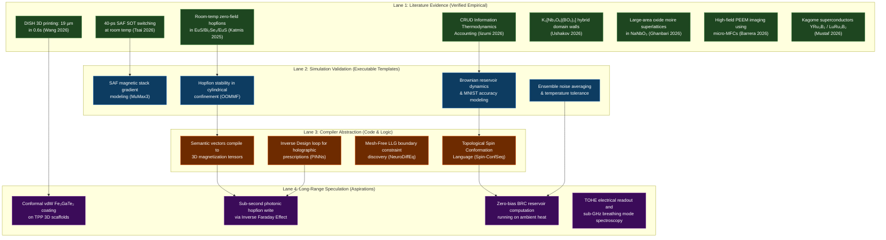

import ClaimsTable from '../../../components/ClaimsTable';

# Claims Matrix

This file tracks the highest-impact HELIOS-3D claims, where they appear, what they depend on, and what would promote or demote them.

### Visual Credibility Map

| Claim | Tag | Source anchor | Source conditions | Failure mode | Promotion or demotion test |
| --- | --- | --- | --- | --- | --- |
| HELIOS-3D is a staged research hypothesis, not a finished hardware platform | `README.md`, `index.md` | Repo framing | Applies globally | Overstated certainty | Keep if all branch docs stay labeled by stage |
| Planar-first, electrically read, multilayer spintronic stack is the minimum credible path | `ALTERNATIVE_MATERIALS_AND_METHODS.md` | Current demonstrator memo | Flat substrate, sputter/lithography, Hall/TMR/AHE/THE style readout | Direct 3D deposition path remains unsupported | Promote when a planar demonstrator works; demote if planar stack fails |
| Direct conformal deposition of `Fe3GaTe2` on a complex 3D polymer scaffold is unverified | `OPEN_QUESTIONS.md`, `PROPOSED_FABRICATION_PATH_AND_CONTROL.md` | Fabrication blocker notes | Polymer scaffold plus magnetic coating | Delamination, poor nucleation, degraded anisotropy | Promote only after repeatable conformal film quality is shown |
| Zero-field or low-bias hopfion operation is a demonstrated capability in EuS/Bi2Se3/EuS | `CORE_ARCHITECTURE.md`, `CANDIDATE_MATERIALS_AND_MECHANISMS.md`, `LITERATURE_REVIEW.md` | Long-range branch docs | $EuS/Bi_2Se_3/EuS$ trilayers | Surface-state interference or interface oxidation | Keep if room-temperature zero-field stability remains reproducible in LTEM |
| Hopfion annihilation barrier exceeds $50 k_B T$ in $EuS/Bi_2Se_3/EuS$ | `LITERATURE_REVIEW.md`, `OPEN_QUESTIONS.md` | Literature Review | Room-temperature, zero-field | Proximity effect decays at higher currents | Promote to verified once measured in a multi-gate MCA device |
| `Fe3GaTe2` is a plausible candidate material, but only on flat substrates today | `CANDIDATE_MATERIALS_AND_MECHANISMS.md` | Candidate materials memo | Flat epitaxial growth | 3D transfer invalidates properties | Promote to integration candidate only after transfer or bonding tests |
| DISH enables sub-second (0.6s) 3D scaffolding with 19 µm resolution on fixed surfaces | `LITERATURE_REVIEW.md`, `PROPOSED_FABRICATION_PATH_AND_CONTROL.md`, `ALTERNATIVE_MATERIALS_AND_METHODS.md`, `module_6_modular_tiling_scaling.md` | Fabrication branch notes | Single-side holographic projection and modular tiling | Insufficient adhesion between tiles or resolution degradation during chemical welding | Promote after successful "holographic weld" of two index-matched tiles |
| Microwave-first readout uses sub-GHz breathing modes for frequency-encoded sensing | `PROPOSED_FABRICATION_PATH_AND_CONTROL.md`, `CORE_ARCHITECTURE.md`, `ALTERNATIVE_MATERIALS_AND_METHODS.md` | Long-range branch docs | RF chain and breathing-mode coupling via FMR/BLS | Readout overhead outweighs device gains or signal overlap in dense arrays | Promote if distinct spectral fingerprints are resolved for individual hopfions |
| CrI3 super-moiré twistronics is a laboratory proof-of-concept | `CANDIDATE_MATERIALS_AND_MECHANISMS.md` | Candidate materials memo | twisted double bilayer CrI3 at ~4 K | Air sensitivity and low-temp constraints prevent room-temp deployment | Promote only after transfer to room-temp magnets (e.g. Fe3GaTe2) with Ta/W capping layers |
| HELIOS-3D targets ultra-low energy computation near efficiency limits | `README.md`, `ABSTRACT.md`, `LITERATURE_REVIEW.md` | Executive summary | Brownian reservoir dynamics and polaritonic benchmarks (~4 fJ) | Ratchet sensitivities and random fluctuations impose overhead | Promote after calibrated energy-per-bit measurements on a stochastic demonstrator |
| Y-zipper mechanism supports reconfigurable or deployable 3D scaffolds | `LITERATURE_REVIEW.md`, `PROPOSED_FABRICATION_PATH_AND_CONTROL.md`, `ALTERNATIVE_MATERIALS_AND_METHODS.md` | Fabrication branch notes | 3D-printed flexible-rigid transition | Structural instability or alignment loss during zipping | Promote after demonstrating sub-micron alignment precision in a zipped rod |
| The thermodynamic crisis is real and measurable | `LITERATURE_REVIEW.md`, `ABSTRACT.md`, `GLOSSARY.md`, `TARGETS_COMPARATORS_AND_PROJECTIONS.md`, `DEFENSIVE_FRAMEWORK.md`, `README.md` | Literature Review | IEA 2024/2026 Projections | Industry trends reverse | N/A |
| AI infrastructure will consume ~600 TWh in 2026 and withdrawal >4 billion m³ water by 2027 | `README.md`, `LITERATURE_REVIEW.md` | IEA & Ren et al. (2025) | Base case expansion scenarios | Breakthrough in software-only optimization | Keep if IEA 2030 projections remain $> 900$ TWh |
| Chiral hopfions enable programmable CISS-mediated bio-chemical sensing | `LITERATURE_REVIEW.md`, `GLOSSARY.md` | Vardi et al. (2026) | Inherently chiral magnetic knots | Signal overlap or insufficient sensitivity for dilute solutions | Promote if isotopic fractionation is observed in a micro-fluidic spintronic channel |
| TOHE provides an unambiguous all-electrical hallmark for 3D hopfions | `LITERATURE_REVIEW.md`, `PROPOSED_FABRICATION_PATH_AND_CONTROL.md`, `module_7_tohe_electrical_detector.md` | Göbel & Lounis (2025/2026) | 3D orbital current generation | Signal-to-noise ratio too low for room-temperature detection | Promote if 3D orbital conductivities are mapped in a Phase 1 trilayer bridge |
| $Mn_3Sn$ supports deterministic 40-ps switching at $1.7 pJ/\mu m^2$ energy density | `LITERATURE_REVIEW.md`, `CANDIDATE_MATERIALS_AND_MECHANISMS.md` | Tsai et al. (Science 2026) | Octupole switching in Weyl AFM | Uncontrolled heating at high duty cycles | Keep as primary high-speed node candidate for Phase 3 |
| TLPs ("Flying Doughnuts") enable robust inter-module topological data transfer | `LITERATURE_REVIEW.md`, `GLOSSARY.md` | Niu et al. (2026) | Space-time non-separable pulses | Excessive dispersion or topological decay in non-ideal media | Promote if skyrmionic textures are successfully "read" from a TLP after macroscopic propagation |
| `< 100 ps` write speed per logical node is a demonstrated capability | `PROPOSED_FABRICATION_PATH_AND_CONTROL.md`, `LITERATURE_REVIEW.md` | Write-phase table | 40-ps AFM switching and 60-ps optical photocurrents | High-frequency jitter or signal attenuation in macroscopic buses | Keep as verified high-speed performance floor |
| `< 2 pJ/µm²` write energy is a demonstrated capability | `PROPOSED_FABRICATION_PATH_AND_CONTROL.md`, `LITERATURE_REVIEW.md` | Write-phase table | $Mn_3Sn$ switching at room temperature | Excessive insertion loss in optical-to-SOT interface | Keep as verified energy-efficiency floor |
| Metal-directed β-sheet-like assembly can produce free-standing ultrathin 2D peptide crystals with programmable sequence, chirality, and side-chain chemistry | `LITERATURE_REVIEW.md`, `CANDIDATE_MATERIALS_AND_MECHANISMS.md`, `GLOSSARY.md` | Wang et al., Nature Chemistry 2026 | Metal-peptide layered crystals exfoliated into ultrathin nanosheets | Limited generality across peptide sequences or device environments | Promote for HELIOS interface use only after transfer onto relevant substrates without loss of crystallinity or function |
| 2D peptide crystals can stereoselectively bind glucocorticoids and chiral pharmaceutical molecules | `LITERATURE_REVIEW.md`, `CANDIDATE_MATERIALS_AND_MECHANISMS.md` | Wang et al., Nature Chemistry 2026 | Molecular recognition experiments, enantioselectivity up to 20.9 | Binding may not produce a measurable spintronic or optical signal | Promote to sensing candidate only after binding events couple to an electrical, magnetic, or optical readout |
| Programmable chiral 2D peptide nanosheets may serve as a molecular recognition layer for HELIOS-style chiral spintronic sensing | `CANDIDATE_MATERIALS_AND_MECHANISMS.md`, `OPEN_QUESTIONS.md`, `LITERATURE_REVIEW.md` | HELIOS bio-interface side branch | Requires stable transfer, interface preservation, and measurable spin-selective coupling | No CISS or proximity coupling; organic layer degrades under device conditions | Promote only after a peptide layer modulates spin transport, magnetoresistance, Kerr signal, or skyrmion behavior in a test stack |
| hBN encapsulation twist-angle alignment between 15° and 45° induces anomalous gating and strong hysteresis | `alternative-materials-and-methods.mdx`, `literature-review.mdx`, `module_2_super_moire_engineering.md` | Maffione et al. (Nature Materials 2026) | Encapsulation of 2D/vdW layers with two misaligned hBN sheets at room temperature | Hysteresis is suppressed or absent due to interface defects or surface contamination | Verify and map SOT switching efficiency as a function of encapsulant twist angle in a multi-gate test track |
| Altermagnets support strongly spin-polarized currents without net magnetization and exhibit fast spin dynamics | `candidate-materials-and-mechanisms.mdx`, `literature-review.mdx` | Jungwirth et al. (Nature Physics 2026) | Crystals with collinear compensated spin ordering and d-wave (or higher even-parity) symmetry | Relativistic spin-orbit coupling is too weak to generate detectable spin currents at room temperature | Verify and map spin current polarization and dynamics in a micro-structured altermagnetic channel |
| 3D integrated photonic vias and waveguide couplers enable high-density vertical optical interconnects with up to two-fold latency/energy reduction | `alternative-materials-and-methods.mdx`, `literature-review.mdx` | Weninger et al. (Light: Science & Applications 2026) | Use of guided-mode or free-form photonic vias (e.g., 45° TIR mirrors) in stacked silicon or glass substrates | Serial fabrication write-time overhead or high alignment sensitivity (e.g. mirror angle &lt; 4° tolerance) limits throughput/yield | Verify alignment tolerance and insertion loss (&lt;1 dB) of a stacked die-to-die vertical via interface in an MVD test package |
| MEMS Phase Light Modulators (PLM) yield a 70-fold increase in tomographic printing laser efficiency and enable speckle-suppressed large-scale volumetric prints | `literature-review.mdx`, `proposed-fabrication-path-and-control.mdx` | Álvarez-Castaño et al. (Light: Science & Applications 2026) | Holographic TVAM/HoloVAM using time-multiplexed lateral shifts of axicon phase patterns | Piston-mirror mechanical wear or phase drift degrades hologram fidelity | Compare curing surface roughness and print times of DMD vs. PLM holographic systems on identical resins |
| Bio-inspired B-ONN local learning rules eliminate global backpropagation reciprocal path constraints and learn smooth phase profiles robust to SOT alignment/noise perturbations | `core-architecture.mdx`, `literature-review.mdx` | Li et al. (Light: Science & Applications 2026) | Layer-wise target propagation with trainable error convolution kernels ($E$) | Suboptimal convergence in systems with very high degrees of freedom compared to global optimization | Compare classification accuracy of traditional backprop vs. B-ONN local learning on a 9-layer diffractive network stack with phase noise |
| Silicon-based T-center spin-photonic qubits provide a native telecom-band interface (1326 nm ZPL) and host a three-qubit register with long spin coherence times | `alternative-materials-and-methods.mdx`, `literature-review.mdx` | Islam et al. (Light: Science & Applications 2026) | Monolithic silicon-on-insulator (SOI) integration with nanophotonic cavities to achieve Purcell enhancement | Low Debye-Waller factor (~3-5% ZPL fraction) reduces extraction efficiency | Measure on-chip collection efficiency and spin coherence times of a waveguide-integrated single T-center cavity at 1.2 K |
| Dual-view Bessel two-photon projection microscopy (dv-B2PM) achieves 100 Hz whole-volume 3D imaging with sub-micron spatial resolution | `literature-review.mdx`, `proposed-fabrication-path-and-control.mdx` | Xu et al. (Light: Science & Applications 2026) | Simultaneous recording of two orthogonal projections using a dual-objective Bessel light-sheet optical system | Scattering and resolution degradation in deep tissue/thick materials limits depth penetration | Compare 3D reconstruction accuracy and acquisition speed of point-scanning 2PM vs. dv-B2PM on active 3D spintronic tracks |
| Machine-learning-guided discovery and synthesis is demonstrated for kagome superconductors YRu₃B₂ and LuRu₃B₂ | `candidate-materials-and-mechanisms.mdx`, `candidate-discovery-pipeline.mdx` | Mustaf et al. (Physical Review Research 2026) | Kagome lattice flat bands | Synthesis scalability or material impurity issues | Demote if superconductivity is found to be driven by non-kagome impurity phases |
| Landauer's erasure bound is the Delete-specific limit of a broader CRUD information-thermodynamic framework | `literature-review.mdx`, `defensive-framework.mdx` | Iizumi (Physica A 2026) | Noneequilibrium free-energy inequalities over physical memory states | Theoretical framework only; does not account for physical device preparation and dissipation | Keep if internal algebraic consistency is supported by machine-checked formalization |
| Classical reversible logic can be proposed using coherent spin dynamics in semiconductor quantum-dot arrays | `literature-review.mdx`, `core-architecture.mdx` | Loss (arXiv:2607.06219v1, 2026) | Coherent spin dynamics in quantum-dot arrays with DC voltage pulses | Theoretical/simulation proposal; experimental verification of three-spin gate and error scaling needed | Promote after experimental demonstration of coherent three-spin classical gate |
| Quantum reservoir performance links to microscopic energetic cost via Holevo memory/predictive capacities | `literature-review.mdx`, `core-architecture.mdx` | Ding & Qiu (arXiv:2607.02157v1, 2026) | Quantum many-body reservoir models out of equilibrium | Theoretical preprint; transfer to magnetic textures or 2D stacks is conceptual only | Promote when reservoir validation metrics are measured in physical hardware |
| Antiferroelectricity and switchable polarization can coexist in K₃[Nb₃O₆|(BO₃)₂] | `candidate-materials-and-mechanisms.mdx`, `literature-review.mdx` | Ushakov et al. (Nature Nanotechnology 2026) | Noncollinear antipolar structure with slight octahedral tilt | Complete dipoles cancellation in all directions | Demote if structural symmetry analysis rules out net polarization |
| Oxide moiré superlattices can be deterministically fabricated over large areas with strong chemical bonding | `candidate-materials-and-mechanisms.mdx`, `literature-review.mdx` | Ghanbari et al. (ACS Nano 2026) | NaNbO₃ membranes aligned via visual markers and thermally annealed | Interlayer misalignment or failure to form strong chemical bonds | Demote if annealing fails to produce high-crystallinity interfaces over large areas |
| Micro-scale magnetic flux concentrators can locally amplify magnetic fields to enable high-field (150 mT) PEEM imaging | `literature-review.mdx`, `proposed-fabrication-path-and-control.mdx` | Barrera et al. (Small 2026) | Metamaterial-inspired flower-like ferromagnetic concentrator geometry | Deflection of photoelectrons at very high field amplification factors ($>$30) | Compare deflection and resolution of PEEM under 30 mT flat field vs. 150 mT focused MFC field |
| Quantum reservoir thermodynamics provides an energy-aware validation framework for physical reservoirs | `thermodynamic-reservoir-validation.mdx`, `README.md` | Ding & Qiu 2026, arXiv:2607.02157v1 | Theory/simulation framework using Holevo-based memory and predictive capacities | Reservoir accuracy improves while irreversible work or non-predictive retained history dominates | Promote if HELIOS simulations report predictive capacity, retained history, readout/reset cost, and irreversible work for the same benchmark |
| CRUD information thermodynamics generalizes deletion-only Landauer accounting | `thermodynamic-reservoir-validation.mdx`, `README.md` | Iizumi 2026, Physica A, DOI: 10.1016/j.physa.2026.131801 | Theory/simulation-backed accounting framework with Lean 4 formalization | HELIOS energy claims omit state preparation, readout, update, reset, or protocol dissipation | Keep as validation guardrail; require full operation lifecycle budget before any energy-efficiency claim |
| Leakage and tunnelling across 2D materials are first-order stack constraints | `2d-stack-reliability-and-readout.mdx`, `candidate-materials-and-mechanisms.mdx` | Yuan et al. 2026, Nature Materials | hBN, MoS₂, WS₂ leakage depends on thickness, bandgap, defect density, and electrode roughness | Monolayer or rough-electrode stacks leak enough to erase projected energy gains | Promote only after HELIOS stack models include leakage, roughness, thickness, and defect-density sensitivity |
| Layered defect emitters can provide polarized single-photon emission | `2d-stack-reliability-and-readout.mdx`, `alternative-materials-and-methods.mdx` | ACS Nano 2026 ZnPS₃ defect-emitter paper | Point defects in layered ZnPS₃ emit polarized single photons under optical excitation | No deterministic placement, scalable array, spin-addressability, or magnetic-reservoir coupling | Promote only after emitter placement, stability, optical coupling, and reservoir-interface tests are defined |

## Detailed Claims

### From erasure to CRUD: unified information-thermodynamic accounting
**Claim level:** Theory / framework / simulation-supported
**Subsystem:** information thermodynamics, operation-level energy accounting, Landauer-bound framing, physical memory operations
**Source:** Iizumi, *Physica A: Statistical Mechanics and its Applications* 2026. DOI: `10.1016/j.physa.2026.131801`
**Supported statement:** Landauer’s erasure bound can be treated as the Delete-specific limit of a broader Create, Read, Update, and Delete (CRUD) accounting framework. The framework uses nonequilibrium free-energy inequalities to account for transformations of probability distributions over physical memory states.
**HELIOS relevance:** Supports HELIOS-3D’s validation philosophy for physical computing: energy claims must account for the full lifecycle of information operations, including reservoir state creation/preparation, physical update or perturbation, readout/measurement, overwrite-like update, relaxation, and deletion/reset.
**Does not support:** Hopfion stability, skyrmion/hopfion reservoir computing, hBN defect computation, material feasibility, quantum advantage, sub-Landauer operation, or the complete HELIOS-3D architecture.
**Failure/blocker notes:** This is a theoretical and simulation-backed accounting framework, not a device demonstration. HELIOS would still require operation-level energy budgets for physical state preparation, driving, coupling, readout, noise management, reset, leakage, and protocol dissipation.
**Special note:** The paper distinguishes state-function information free-energy changes from protocol-dependent dissipation, which is directly useful for separating ideal thermodynamic limits from real implementation losses.

### Classical reversible computation by quantum coherence
**Claim level:** Proposed externally / simulation-supported / arXiv preprint
**Subsystem:** reversible computation, spin-based physical logic, post-Landauer operation accounting, coherent data movement
**Source:** Loss, *Classical Reversible Computation by Quantum Coherence*, arXiv:2607.06219v1, 2026.
**Supported statement:** Classical reversible logic can be proposed using coherent spin dynamics in semiconductor quantum-dot arrays, with basis-state inputs/outputs and unitary spin rotations implementing reversible gates. The paper proposes a DC-pulsed Ge/Si hole-spin iToffoli gate and analyzes gate error, shuttling, readout, and energy cost.
**HELIOS relevance:** Supports the broader plausibility of physical-computing architectures where storage, transport, and computation are implemented by the same physical state variable, and where thermodynamic advantage depends on reversible operation plus explicit accounting of readout, reset, error correction, and protocol dissipation.
**Does not support:** Hopfion stability, skyrmion/hopfion reservoir computing, hBN defect computation, optical spin readout, 2D-material stack feasibility, or the complete HELIOS-3D architecture.
**Failure/blocker notes:** This is a theoretical/simulation proposal, not a demonstrated processor. Experimental tests still need to verify the three-spin truth table, error landscape, exchange stability during hopping, driven capacitance, and shuttling energy. Transfer to HELIOS-style magnetic textures or layered 2D stacks is conceptual only.

### Thermodynamics of quantum reservoir computing
**Claim level:** Theory / simulation-supported / arXiv preprint
**Subsystem:** quantum reservoir computing, information thermodynamics, critical dynamics, predictive-capacity accounting
**Source:** Ding & Qiu, *Thermodynamics of Quantum Reservoir Computing*, arXiv:2607.02157v1, 2026.
**Supported statement:** Quantum reservoir computing can be analyzed using a non-equilibrium thermodynamic framework that links predictive performance to microscopic energetic cost. Holevo-based memory and predictive capacities can separate retained historical information from useful predictive information, and the difference can be treated as quantum informational dissipation.
**HELIOS relevance:** Supports HELIOS-3D’s validation philosophy for physical reservoir inference: candidate reservoirs should be evaluated not only by accuracy, memory, or criticality, but by operation-level energetic cost, predictive capacity, non-predictive history retention, coherence contribution, and irreversible work.
**Does not support:** Hopfion stability, skyrmion/hopfion reservoir computing specifically, hBN defect computation, material feasibility, optical readout integration, sub-Landauer operation, or the complete HELIOS-3D architecture.
**Failure/blocker notes:** This is a theoretical arXiv preprint using quantum many-body reservoir models, not a demonstrated HELIOS-like device. Transfer to magnetic textures, hopfions, 2D stacks, or spin-defect layers is conceptual only.

### Coexisting antiferroelectricity and switchable polarization in $K_3[Nb_3O_6|(BO_3)_2]$
**Claim level:** Demonstrated experimentally
**Subsystem:** switchable topological barriers, domain walls, polar domain boundaries, low-power gating
**Source:** Ushakov et al., *Nature Nanotechnology* 2026. DOI: `10.1038/s41565-026-02139-8`
**Supported statement:** Antiferroelectricity and switchable polarization can coexist in the noncollinear antipolar oxide $K_3[Nb_3O_6|(BO_3)_2]$ due to a slight structural tilt in the niobium ($Nb$) octahedra preventing complete cancellation of dipoles. The domains are separated by highly extended, extremely thin domain walls exhibiting both ferroelectric and antiferroelectric characteristics.
**HELIOS relevance:** Broadens the candidate landscape for functional interfaces and gating layers. Hybrid domain walls can be utilized to construct thin boundaries for low-power confinement or SOT-induced gating. Redefining antiferroelectric limits (Catalan et al., *Nature Materials* 2026) suggests a broader class of non-classical antipolar materials featuring waves, spirals, or tilted dipoles that can host switchable local polarization.
**Does not support:** 3D hopfion stabilization in EuS/Bi₂Se₃/EuS trilayers, skyrmion/hopfion reservoir computing specifically, or full HELIOS-3D integration.
**Failure/blocker notes:** While demonstrated in single crystals, fabricating these oxides as ultrathin conformal films on 3D scaffolds remains untested. Their compatibility with the main spintronic compute stack must be validated.

### Deterministic fabrication of large-area oxide moiré superlattices
**Claim level:** Demonstrated experimentally
**Subsystem:** twistronics, moiré superlattices, oxide membranes, boundary engineering
**Source:** Ghanbari et al., *ACS Nano* 2026. DOI: `10.1021/acsnano.6c04794`
**Supported statement:** Large-area, high-crystallinity oxide moiré superlattices can be deterministically fabricated using crystalline NaNbO₃ membranes with photolithographically defined visual markers for precise twist-angle control, followed by thermal annealing to establish strong chemical bonds.
**HELIOS relevance:** Overcomes the size and stability limitations of traditional van der Waals-bonded 2D materials. Strong interlayer bonding and precise angle control enable the scalable fabrication of robust moiré potential lattices to lock or modulate topological spin textures.
**Does not support:** 3D hopfion stabilization specifically, or direct integration with the magnetic compute core.
**Failure/blocker notes:** Demonstrations are currently limited to NaNbO₃. Extending the process to other complex transition-metal oxides or magnetic materials is planned but remains unverified.

### High-field nanoscale magnetic imaging using micro-scale flux concentrators
**Claim level:** Proposed / externally demonstrated
**Subsystem:** magnetic characterization, PEEM, XMCD, flux concentrators, spintronic imaging
**Source:** Barrera et al., *Small* 2026. DOI: `10.1002/smll.202600073`
**Supported statement:** Micro-scale flower-like magnetic flux concentrators (MFCs) made of ferromagnetic materials can focus and locally amplify an applied magnetic field (by a factor of 5 to 30) within a confined gap, permitting PEEM and XMCD-PEEM imaging of magnetic nanostructures under local fields of at least 150 mT without significant Lorentz-force deflection of photoelectrons.
**HELIOS relevance:** Enables the characterization of hard/semi-hard magnetic layers and high-bias topological spin textures (like hopfions and skyrmions) that require fields exceeding the traditional 30 mT PEEM limit. Integrating micro-MFCs directly onto test substrates allows for in-situ observation of field-dependent transitions.
**Does not support:** 3D volumetric printing, direct hopfion electrical readout, or sub-Landauer compute core operations.
**Failure/blocker notes:** Requires precise integration of the micro-scale MFC geometry directly around or under the spintronic test structures. Fabrication misalignment or sample-concentrator magnetic coupling could perturb the local spin states being imaged.

### Machine-learning-guided discovery of kagome superconductors
**Claim level:** Demonstrated experimentally
**Subsystem:** material discovery, candidate screening, flat-band systems, kagome lattices
**Source:** Mustaf et al., *Machine-learning-guided discovery of kagome superconductors YRu₃B₂ and LuRu₃B₂*, *Physical Review Research* (2026). DOI: `10.1103/lpqj-7hyg`
**Supported statement:** Machine learning can be used to prescreen billions of elemental combinations, which, followed by targeted calculations and synthesis, can successfully identify and confirm new kagome lattice superconductors ($YRu_3B_2$ and $LuRu_3B_2$) featuring flat bands.
**HELIOS relevance:** Validates the machine-learning-guided candidate discovery pipeline. Flat-band kagome materials offer stable physical systems to investigate topological transport, correlation effects, and electron-spin dynamics for spintronic device designs.
**Does not support:** 3D hopfion stabilization, skyrmion/hopfion reservoir computing specifically, or full HELIOS-3D integration.
**Failure/blocker notes:** Finding viable superconductors is computationally heavy; and even if theoretical screening succeeds, synthesis remains a complex chemical combination process. Real-world devices require verifying that the superconducting properties persist in thin-film configurations.
